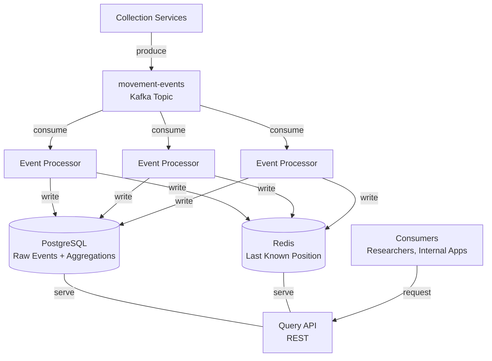
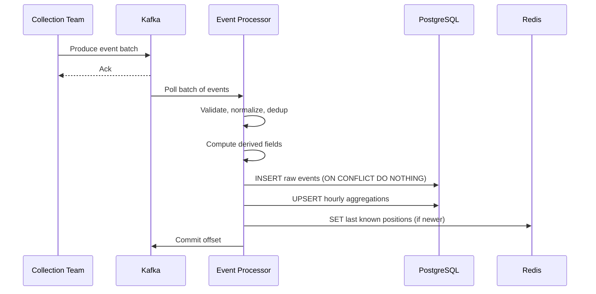

# System Design: Real-Time Movement Intelligence Platform

## System Components & Data Flow

Another team collects raw movement data from devices and clients and produces events into a Kafka topic. Our system consumes from that topic, processes the data, and stores it in three forms:

- **Raw events** (PostgreSQL) - every event stored as-is, the source of truth
- **Hourly aggregations per entity** (PostgreSQL) - pre-computed stats per entity per hour
- **Last known position per entity** (Redis) - updated on each new event

The raw events table is partitioned by timestamp (e.g. monthly) for efficient time-range queries and cheap data retention (drop old partitions instead of deleting rows).

The Kafka topic is partitioned by `entity_type:entity_id`. Multiple processor instances form a consumer group - each instance handles a subset of partitions, so all events for a given entity go to the same processor. This lets us do stateful processing (dedup, previous-event lookups) locally without distributed coordination.

---

## Ingestion Flow

Events that fail validation go to a dead-letter topic for investigation - they're never silently dropped.

**Duplicates** are handled at two levels: in-memory tracking of seen event IDs catches most duplicates before they reach the database, and the primary key constraint on `event_id` with `ON CONFLICT DO NOTHING` acts as the final safety net.

**Out-of-order events** are handled per data type: raw events are stored as-is, last known position only overwrites if newer, and aggregations use additive upserts that produce the same result regardless of order.

**Optional fields** like speed, heading, and accuracy are stored as nullable columns. The aggregation logic accounts for this so averages stay accurate.

---

## Querying & Consumption Interface

| Endpoint | Purpose | Backed by |
|---|---|---|
| `GET /v1/entities/:type/:id/position` | Last known position | Redis |
| `GET /v1/entities/:type/:id/history?from=&to=` | Historical positions in time range | PostgreSQL raw events |
| `GET /v1/entities/:type/:id/stats?from=&to=` | Aggregated stats (speed, event count) | PostgreSQL aggregations |
| `GET /v1/events?from=&to=&entity_type=` | Bulk event export | PostgreSQL raw events |

All list endpoints use cursor-based pagination for consistent performance.

---

## Technology Choices & Tradeoffs

### Kafka

Offsets are committed after successful writes, giving us at-least-once delivery. Since all writes are idempotent, at-least-once is sufficient without the complexity of exactly-once coordination.

### PostgreSQL

Our access patterns are entity-specific time-range lookups, aggregation upserts, and dedup via unique constraints. PostgreSQL fits well - B-tree indexes, atomic upserts, unique constraints, and full SQL for ad-hoc queries. If write throughput or storage becomes a bottleneck, the path forward is introducing a columnar store for raw events while keeping PostgreSQL for aggregations and lookups.

### Redis

Last known position is the highest-frequency query in the system - real-time apps like live maps need sub-millisecond lookups. PostgreSQL can serve this but Redis is significantly faster for simple key-value access.
